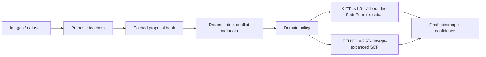

# Dream3R v1.1 Official Completion Plan - 2026-06-08

## Purpose

This plan turns the verified `v1.1.0` official release into a package that is
usable, explainable, and reproducible without reading the whole repository.

Current official status:

```text
version: v1.1.0
official API: dream3r.release_v11.build_dream3r_v11_release
metric: AbsRel, lower is better
KITTI / ETH3D: 0.1448 / 0.0570
stable fallback: v1.0-rc1 at 0.1448 / 0.1475
```

The release claim is state-conditioned proposal-fusion 3R. It is not a
proposal-free foundation 3R model.

## Today Stop Condition

Stop only when all five surfaces exist and are verified:

```text
1. Public model card.
2. Architecture diagram and paper-safe narrative.
3. One-command v1.1 demo entrypoint.
4. End-to-end smoke from proposal-bank-like input to official output.
5. Updated release checklist, reproduce notes, and artifact manifest.
```

Minimum verification target:

```text
local release verifier: pass
local demo smoke: pass
local release tests: pass
BUAA-Server GPU1 release verifier: pass
BUAA-Server GPU1 demo smoke: pass
frozen core diff: empty
```

## Architecture To Present

```text
images / datasets
-> real proposal teachers
-> cached proposal bank
-> Dream state and conflict metadata
-> domain policy
   -> KITTI: v1.0-rc1 bounded StatePrior + residual
   -> ETH3D: VGGT-Omega-expanded SCF correct-state
-> final pointmap and confidence
```

Official modules:

| Surface | File | Role |
| --- | --- | --- |
| Official API | `code/dream3r/release_v11.py` | Domain-conditional v1.1 wrapper. |
| Fallback API | `code/dream3r/release_candidate.py` | Stable v1.0 fallback and regression gate. |
| State prior | `code/dream3r/state_prior_head.py` | Dream-state expert prior support. |
| Proposal decoder | `code/dream3r/proposal_set_decoder.py` | KITTI branch reconstruction head. |
| SCF head | `code/dream3r/scf_head.py` | ETH3D branch proposal fusion head. |
| Verifier | `code/dream3r/scripts/verify_v11_release.py` | Official package consistency gate. |
| Smoke | `code/dream3r/scripts/smoke_v11_release_model.py` | Current synthetic branch smoke. |

Research-only modules stay out of the official claim:

```text
ProposalFree3R, Foundation3R, Qwen semantic controller, NativeStudent,
ImageStateStudent
```

## Workstream A - Model Card

Create:

```text
release/MODEL_CARD_V1_1.md
```

Required content:

```text
model name and version
official import
input contract
output contract
metrics and controls
fallback path
intended use
non-claims
known limitations
verification commands
server path and GPU1 rule
```

Acceptance:

```text
The card is readable without opening ARCHITECTURE.md.
It explicitly says AbsRel is lower-is-better.
It explicitly says proposal-free/Foundation3R/Qwen are not promoted.
```

## Workstream B - Architecture Diagram

Create:

```text
release/ARCHITECTURE_DIAGRAM_V1_1.md
```

Required diagram:



Acceptance:

```text
The diagram separates official, fallback, and research-only paths.
The text explains why VGGT-Omega is a branch, not the whole model.
```

## Workstream C - One-Command Demo

Create:

```text
code/dream3r/scripts/run_dream3r_v11_demo.py
```

Minimum modes:

```text
--mode synthetic
--domain kitti|eth3d
--output runs/release/v11_demo/demo_<domain>.json
```

Optional mode if cache format can be loaded cleanly today:

```text
--mode cache
--cache <path>
--index 0
```

Required JSON output:

```text
version
domain
domain_branch
input_contract
output_shapes
expert_weight_sum_min
expert_weight_sum_max
metadata
claim_boundary
```

Acceptance:

```text
python -B code/dream3r/scripts/run_dream3r_v11_demo.py --mode synthetic --domain kitti
python -B code/dream3r/scripts/run_dream3r_v11_demo.py --mode synthetic --domain eth3d
```

Both commands must pass locally and on BUAA-Server GPU1.

## Workstream D - End-To-End Smoke

Current smoke proves both official branches execute on synthetic proposal-bank
tensors. The missing public surface is a demo artifact smoke.

Create or extend:

```text
code/dream3r/scripts/smoke_v11_release_model.py
runs/release/v11_demo/
```

Target behavior:

```text
synthetic proposal-bank-like input
-> build_dream3r_v11_release()
-> official output JSON
-> schema check
```

If real cache loading is too risky today, keep cache mode as a documented
follow-up and do not block the official demo. Do not silently claim real-cache
end-to-end if only synthetic proposal-bank tensors were used.

Acceptance:

```text
demo JSON exists for KITTI and ETH3D
expert weights sum to 1.0
final pointmap/confidence shapes are present
release_metadata version is v1.1.0
```

## Workstream E - Documentation Chain

Update these documents after A-D:

```text
TASK_SNAPSHOT.md
WORKFLOW_STATUS.md
INDEX.md
release/PUBLISH_CHECKLIST.md
release/REPRODUCE.md
release/VERIFY_REPORT.md
release/ARTIFACTS.json
```

Acceptance:

```text
rg finds no stale "v1.1 promotion candidate" or "v1.0 official package" wording
release/ARTIFACTS.json parses
release/ARCHITECTURE_STATUS.json parses
```

## Workstream F - Verification

Local:

```powershell
python -B code\dream3r\scripts\verify_v11_release.py --root .
python -B code\dream3r\scripts\smoke_v11_release_model.py --output runs\release\v11_smoke\smoke_v11_release_model.json
python -B code\dream3r\scripts\run_dream3r_v11_demo.py --mode synthetic --domain kitti --output runs\release\v11_demo\demo_kitti.json
python -B code\dream3r\scripts\run_dream3r_v11_demo.py --mode synthetic --domain eth3d --output runs\release\v11_demo\demo_eth3d.json
python -B -m pytest --assert=plain code\dream3r\tests\test_release_candidate_architecture.py code\dream3r\tests\test_release_candidate_verifier.py code\dream3r\tests\test_release_v11_architecture.py code\dream3r\tests\test_release_v11_verifier.py code\dream3r\tests\test_release_v11_smoke_model.py -q
git diff --check
git diff --name-only -- code\dream3r\model.py code\dream3r\anchor_bank.py code\dream3r\nsa_attention.py code\dream3r\bus.py code\dream3r\orchestrator.py code\dream3r\repair.py code\dream3r\modules.py code\dream3r\contracts.py code\dream3r\config.py
```

Server:

```bash
cd /hdd3/kykt26/code/dream3r
export CUDA_VISIBLE_DEVICES=1
conda run -n dream3r python -B dream3r/scripts/verify_v11_release.py --root . --skip-frozen-core
conda run -n dream3r python -B dream3r/scripts/run_dream3r_v11_demo.py --mode synthetic --domain kitti --output runs/release/v11_demo/demo_kitti.json
conda run -n dream3r python -B dream3r/scripts/run_dream3r_v11_demo.py --mode synthetic --domain eth3d --output runs/release/v11_demo/demo_eth3d.json
```

## Known Gaps After Today

These are real gaps, but they should not block official v1.1 packaging:

| Gap | Status | Today Action |
| --- | --- | --- |
| Proposal-free foundation 3R | Not solved | Keep research-only. |
| Foundation3R | State-causality negative | Do not promote. |
| Qwen semantics | Diagnostic-negative | Keep out of geometry claim. |
| Real dataset one-command evaluation | Not packaged | Document as future evaluator. |
| Cache-mode public demo | Optional today | Add only if schema is clean. |
| Installable wheel / package metadata | Not required for current release | Defer unless distribution is requested. |

## Execution Order

1. Write `MODEL_CARD_V1_1.md`.
2. Write `ARCHITECTURE_DIAGRAM_V1_1.md`.
3. Implement `run_dream3r_v11_demo.py` synthetic mode.
4. Add a focused demo test if implementation touches code.
5. Update release docs and artifact manifest.
6. Run local verification.
7. Sync to BUAA-Server and run GPU1 verifier/demo.
8. Close `TASK_SNAPSHOT.md` with exact evidence.

## Decision Rule

If a step starts expanding into new model research, stop and split it out. The
goal today is not a better model; it is a complete official v1.1 package.
