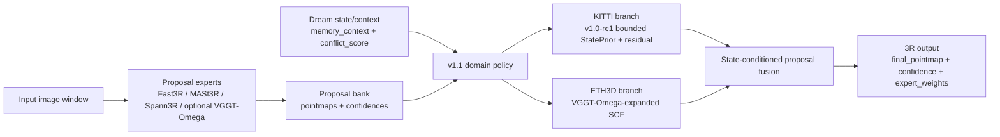
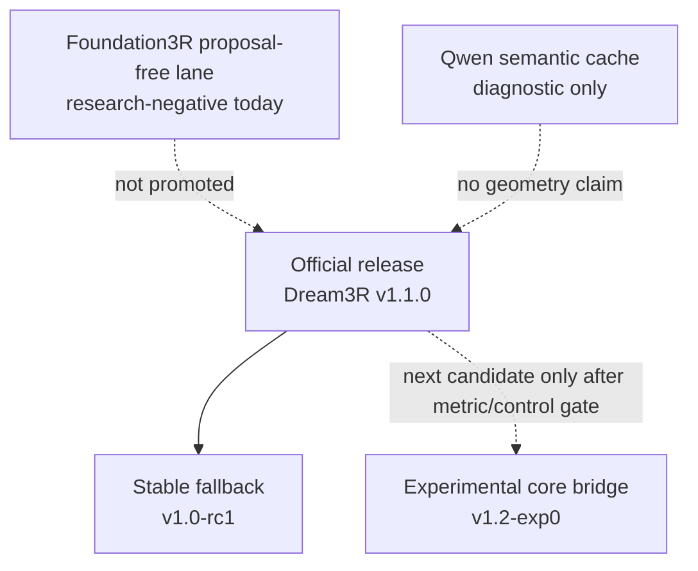

# Dream3R v1.1.0 Architecture Diagram

Date: 2026-06-08
Status: official v1.1 architecture diagram

## Official Path



## Runtime Branches

| Domain | Official branch | Experts | Selected AbsRel |
|---|---|---|---:|
| KITTI | `kitti_v1_0_rc1` | Fast3R, MASt3R, Spann3R | 0.1448 |
| ETH3D | `eth3d_vggt_omega_scf` | Fast3R, MASt3R, Spann3R, VGGT-Omega | 0.0570 |

Metric direction: lower is better.

## State-Causality Gate

| Domain | Correct state | No state | Shuffle state | Verdict |
|---|---:|---:|---:|---|
| KITTI | 0.1448 | 0.1553 | 0.1521 | correct state wins |
| ETH3D | 0.0570 | 0.0583 | 0.0598 | correct state wins |

This is the main reason v1.1.0 is the current official package.

## Placement Of Side Lanes



## Paper-Safe Description

Use:

```text
Dream3R v1.1.0 is a controlled state-conditioned proposal-fusion 3R system.
It routes between a bounded StatePrior residual branch and a VGGT-Omega-expanded
SCF branch, with state/no-state/shuffle controls validating the state signal on
the selected KITTI and ETH3D gates.
```

Do not use:

```text
Dream3R is proposal-free.
Dream3R is an image-only foundation model.
Qwen improves geometry.
VGGT-Omega is the whole model.
```

## Demo Artifacts

The one-command demo writes:

```text
runs/release/v11_demo/demo_kitti.json
runs/release/v11_demo/demo_eth3d.json
```

These demo files prove the official runtime contract and output shapes. They
are not benchmark reruns.

The real proposal-cache runtime demo writes:

```text
runs/release/v11_cache_demo/cache_demo_kitti.json
runs/release/v11_cache_demo/cache_demo_eth3d.json
```

These cache-demo files prove that v1.1 consumes existing SCF/VGGT-Omega cache
entries with the documented branch policy. They are also not benchmark reruns.
