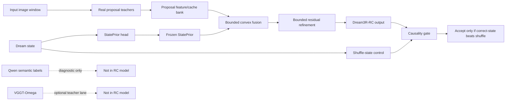

# Dream3R-RC Method Figure

Date: 2026-06-06

## Figure Caption

Dream3R-RC uses real proposal teachers and a frozen StatePrior to produce a
state-conditioned bounded proposal fusion. The residual refinement is bounded
so it cannot freely overwrite the state prior. The candidate is accepted only
when the correct-state path beats shuffled-state controls.

## Mermaid Diagram



## Paper/Slide Version

```text
Input window
  -> real MASt3R/Fast3R/Spann3R proposal caches
  -> bounded convex fusion
  -> bounded residual refinement
  -> Dream3R-RC output

Dream state
  -> StatePrior head
  -> freeze prior
  -> state-conditioned fusion weights

Release gate
  -> compare correct-state against shuffled-state control
  -> accept only if state-causality survives
```

## Visual Claim Boundary

The diagram should not show Qwen or VGGT-Omega as part of the RC inference
path. They are shown only as diagnostic/teacher lanes outside the release
candidate.

